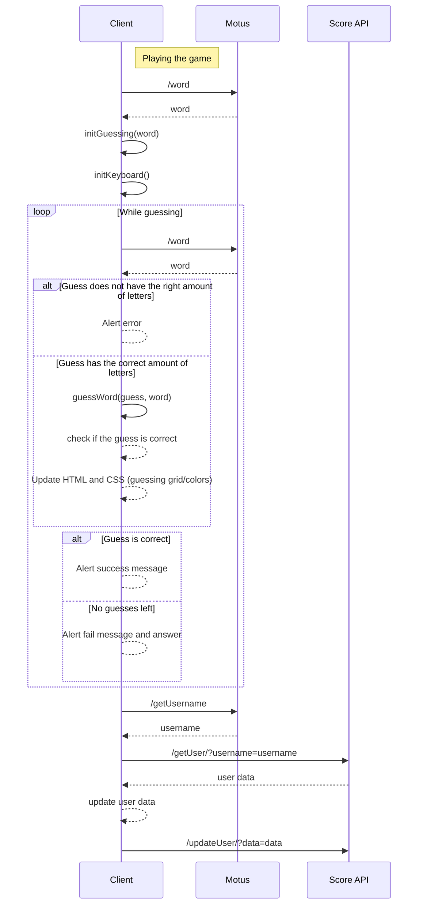
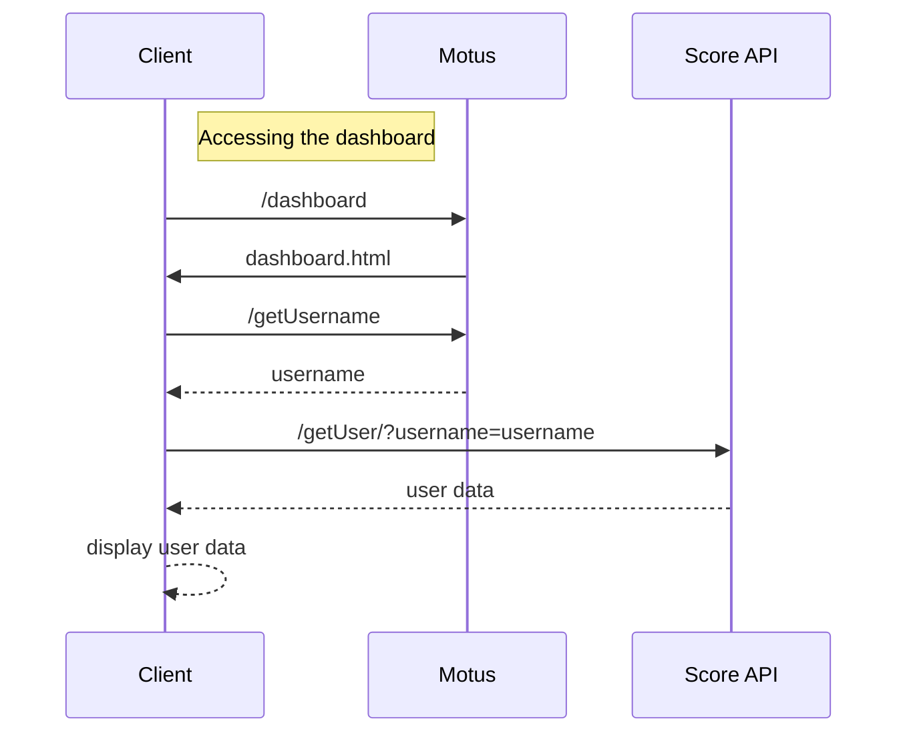

# Micro Services Project 
This repository hosts the project for the micro-services class. 

## Introduction
The project is supposed to be a [SUTOM](https://sutom.nocle.fr/#)/[WORDLE](https://www.nytimes.com/games/wordle/index.html) clone. The project presents itself under the from of a web-app, and was coded using `JavaScript`, `HTML`, `css` and `Docker`. 

Each day, users can guess a word in 6 tries. For each guess the web-app indicates weather the letters are correct or incorrect, depending on the positions and actual entries. 

## App Structure
```
├── Docker-compose.yml
├── Dockerfile
├── data
│   ├── liste_francais.txt
│   └── liste_francais_utf8.txt
├── haproxy.conf
├── index.js
├── package.json
└── public
    ├── scripts
    │   ├── keyboard.js
    │   ├── login.js
    │   ├── logout.js
    │   ├── score.js
    │   └── script.js
    ├── styles
    │   ├── login-logout.css
    │   ├── score.css
    │   └── style.css
    └── templates
        ├── index.html
        ├── login.html
        └── score.html
```

### The Main Pages
This app contains 3 main pages:
- the login page
- the game
- the dashboard

These pages all have a respective tamplate, style sheet and use various scripts which are all located in the `public` folder. This folder is set as the `static` folder thanks to the `Express.js` framework.

### The Backend
The backend is located in `index.js`, where all the endpoints are defined:
- `/` (root), the game in itself
- `/static/`, containing the static files in the public folder
- `/login/`, the login page
- `/word/`, the endpoint containing the word of the day
- `/score/`, the dashboard


## How to make it work

- clone the repository using `GitHub Desktop` or `GitHub Web`
- get into the right directory 
- open a terminal

#### Using node
- `node index.js`
- go to `localhost:4000`

#### Using Docker
- `docker build --tag sutom .`
- `docker-compose up -d`
- go to `localhost:4000`

## Schematic Diagrams ([Mermaid.js](https://mermaid-js.github.io/))

### Sequence Diagram: Playing the game



### Sequence Diagram: the Dashboard
