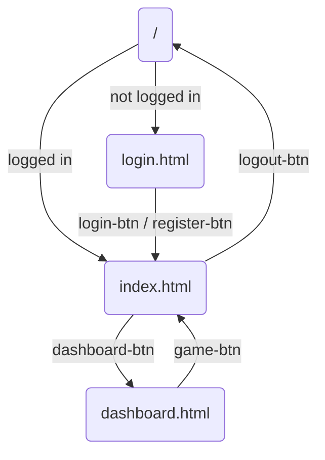
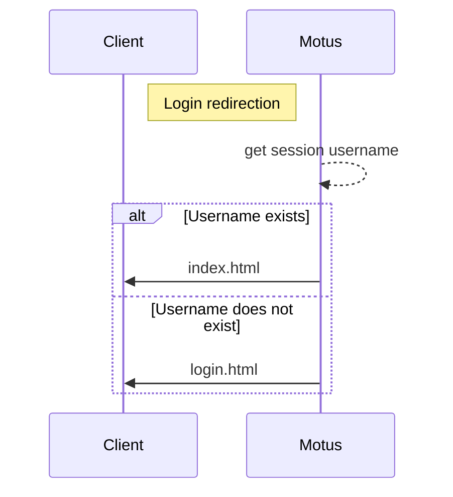
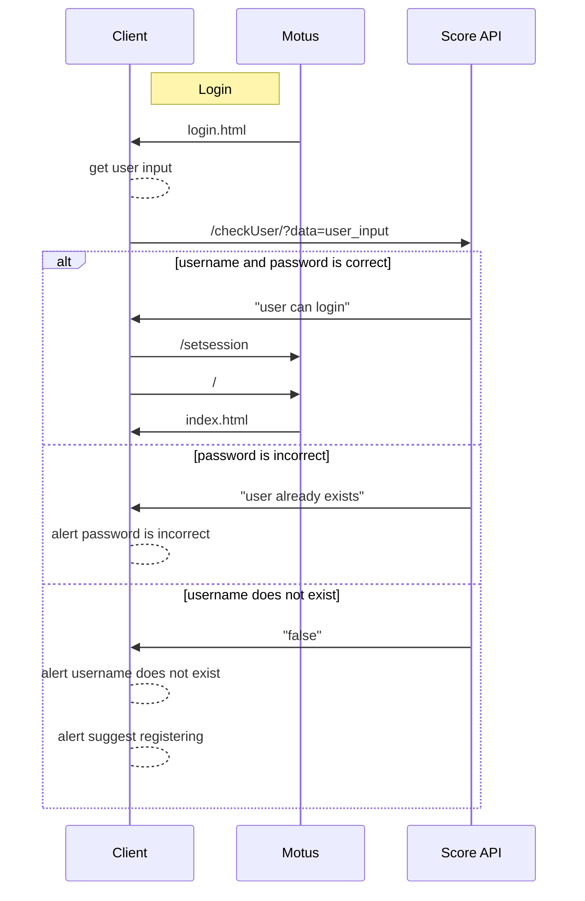
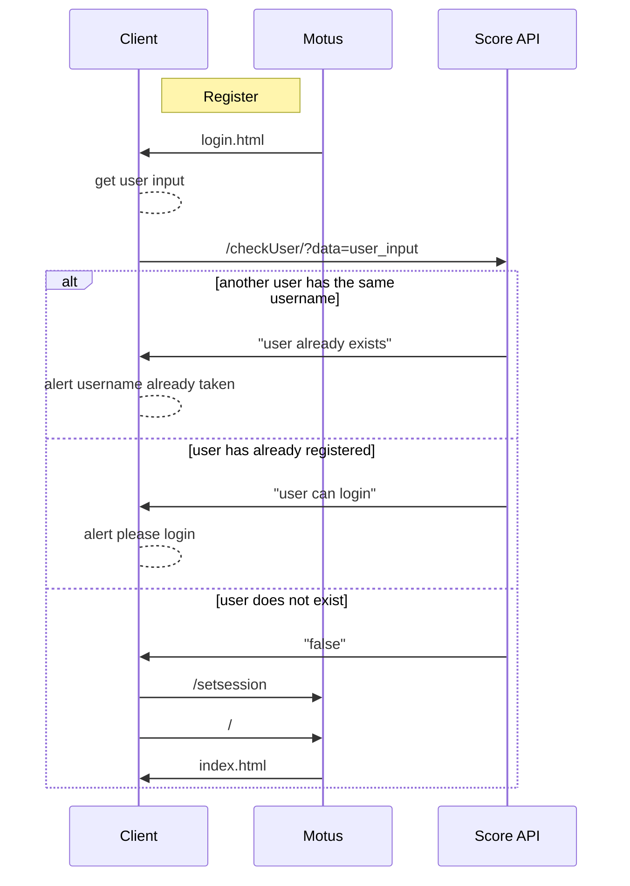
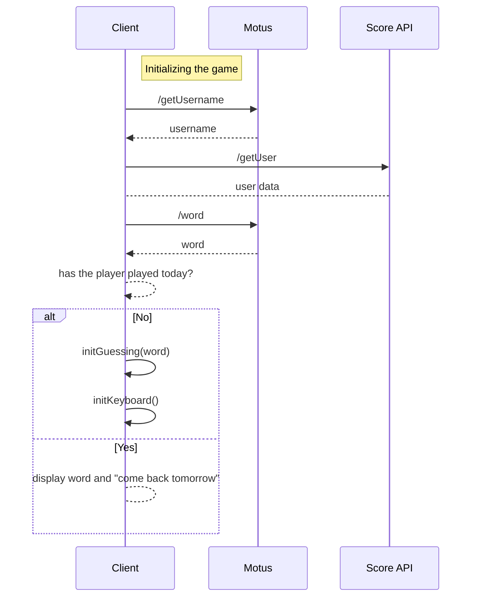
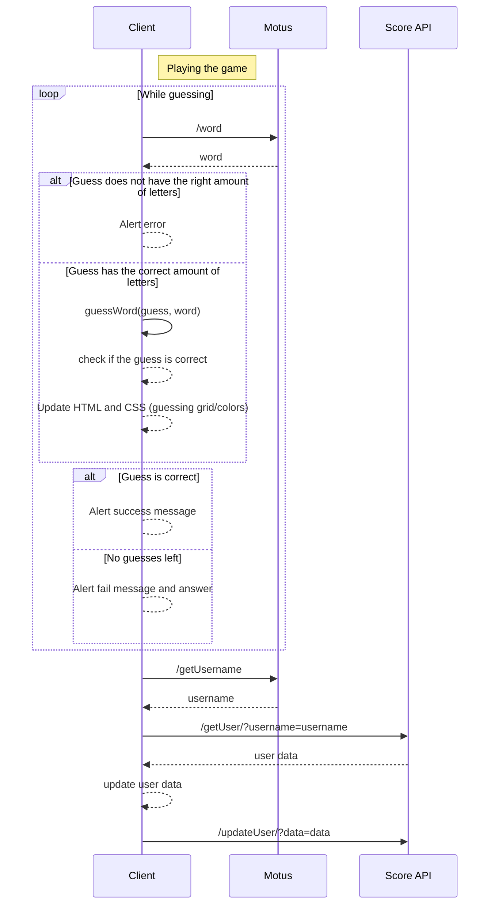
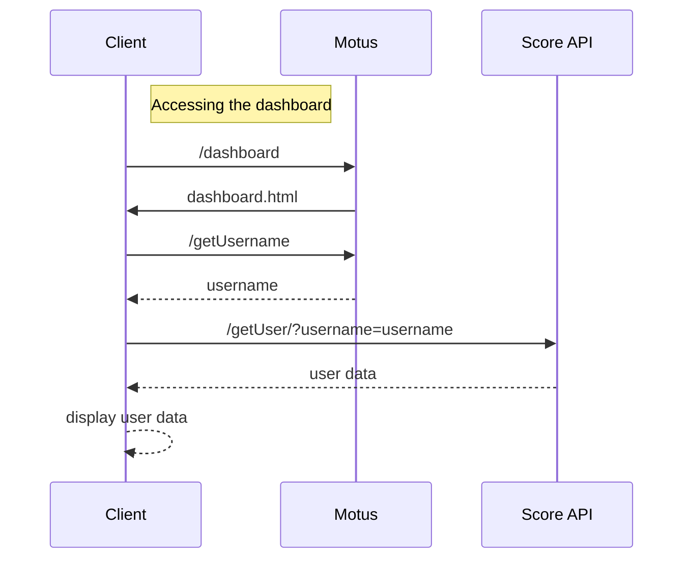
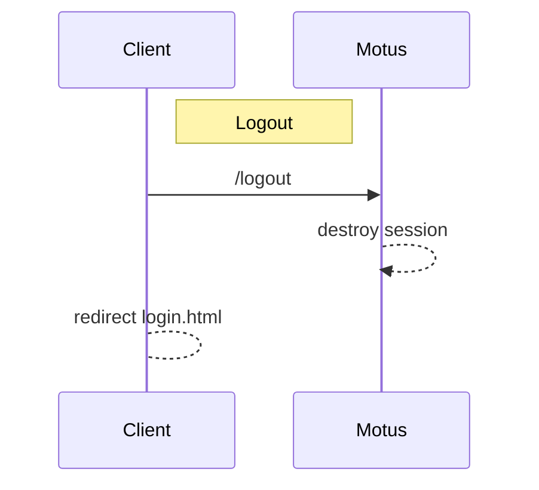

# Micro Services Project 
This repository hosts the project for the micro-services class. 

## Introduction
The project is supposed to be a [SUTOM](https://sutom.nocle.fr/#)/[WORDLE](https://www.nytimes.com/games/wordle/index.html) clone. The project presents itself under the from of a web-app, and was coded using `JavaScript`, `HTML`, `css` and `Docker`. 

Each day, users can guess a word in 6 tries. For each guess the web-app indicates weather the letters are correct or incorrect, depending on the positions and actual entries. 

## App Structure
### File Tree
```shell
.
├── Docker-compose.yml
├── README.md
├── score
│   ├── Dockerfile
│   ├── data
│   │   ├── score.txt
│   │   └── users.txt
│   ├── package-lock.json
│   ├── package.json
│   └── score.js
└── sutom
    ├── Dockerfile
    ├── data
    │   ├── liste_francais.txt
    │   └── liste_francais_utf8.txt
    ├── haproxy.conf
    ├── index.js
    ├── package-lock.json
    ├── package.json
    └── public
        ├── scripts
        │   ├── dashboard.js
        │   ├── keyboard.js
        │   ├── login.js
        │   ├── logout.js
        │   ├── register.js
        │   ├── script.js
        │   └── users.js
        ├── styles
        │   ├── dashboard.css
        │   ├── login-logout.css
        │   └── style.css
        └── templates
            ├── dashboard.html
            ├── index.html
            └── login.html
```

### The Main Pages
This app contains 3 main pages:
- the login page
- the game
- the dashboard

These pages all have a respective template, style sheet and use various scripts which are all located in the `sutom/public` folder. This folder is set as the `static` folder thanks to the `Express.js` framework.

### The Game Backend
The backend is located in `sutom/index.js`, where all the endpoints are defined:

#### The endpoints
- proper to the server
    - `/static/`, containing the static files in the public folder
    - `/session/`, which returns a JSON string of the session
    - `/setsession/`, which sets a username variable in the session
    
- pages 
    - `/` (root), the game in itself
    - `/login/`, the login page
    - `/dashboard/`, the dashboard page

- other actions
    - `/logout/`, which deletes the session
    - `/word/`, the endpoint containing the word of the day
    - `/getUsername/`, returns the session username

### The Score API Backend
The score backend is located in `score/score.js`, where all the endpoints are defined. This backend manages all calls to the databases, which create, read, or update user information.

#### The Databases
The data is stored in two flatfiles, `users.txt` and `score.txt`. The first is structured such as:

| username | hashed password   |
|----------|-------------------|
| user_1   | sd89seb3ie2noihfs |
| user_2   | seoj308osjbwqiofw |
| user_3   | asd09b5si3nf9hfps |
| ...      | ...               |

The password is hashed using `crypto` for security reasons.

The second:

| username | score | average | date       | boolean |
|----------|-------|---------|------------|---------|
| user_1   | 3     | 2.5     | 2022-10-14 | false   |
| user_2   | 7     | 5.4     | 2022-10-09 | true    |
| user_3   | 2     | 1.2     | 2022-09-03 | true    |
| ...      | ...   | ...     | ...        | ...     |

The **score** is the number of won games, **average** is the average number of tries it took over the multiple games. The **date** represents the last time a user played and the **boolean** if he won on that day. 


#### The endpoints

- `/getUser/`, returns all user data from `score.txt`
- `/intializeUser/`, creates a new user in the database with a score and average of 0
- `/userRegistration/`, hashes the password input from the user and saves it in `users.txt` along with the username
- `/updateUser/`, updates user data when they win/loose a game
- `/checkUser/`, checks if a user exists in the database


## How to make it work

- clone the repository using `GitHub Desktop` or `GitHub Web`
- get into the project directory 

### Using node
- motus server
    - open a terminal
    - `cd motus`
    - `node index.js`
- score server
    - open a terminal
    - `cd score`
    - `node score.js`
- go to [localhost port 4000](http://localhost:4000/)

### Using Docker
- `docker-compose up -d`
- go to [localhost port 4000](http://localhost:4000/)

## Schematic Diagrams ([Mermaid.js](https://mermaid-js.github.io/))

### Flowchart: Webapp Structure


### Sequence Diagram: Login Redirection


### Sequence Diagram: Login


### Sequence Diagram: Register



### Sequence Diagram: Initializing the game


### Sequence Diagram: Playing the game



### Sequence Diagram: the Dashboard


### Sequence Diagram: Logout
